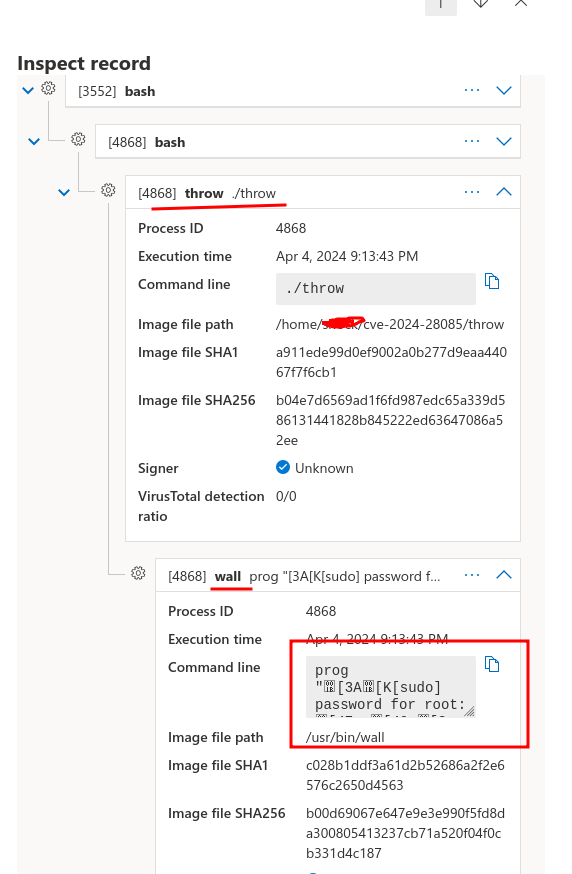

## Wall-Escape (CVE-2024-28085)
### Vulnerability:
The util-linux wall command does not filter escape sequences from command line arguments.
### KQL query for detection
It's unusual to find **[sudo] password for root:** in the *ProcessCommandLine* field. If found, the WallEscape exploit was executed  
```
//Query for detecting fake sudo prompt
DeviceProcessEvents
| where ProcessCommandLine has_any ("[sudo] password for root:","[sudo] password for ") or ProcessCommandLine  has_all ('prog','[sudo] password for root:') or 
| where FolderPath=~"/usr/bin/wall"
```
**Process Tree:**  


In Ubuntu, the command-not-found and snap advice-snap commands leak the unknown command.  
```
/usr/bin/python3 /usr/lib/command-not-found -- Password  
/usr/bin/snap advise-snap --format=json --command Password  
```
Below query detects the password leaks:
```
DeviceProcessEvents
| where ProcessCommandLine has_any ('/usr/lib/command-not-found --', 'advise-snap --format=json --command')
```
